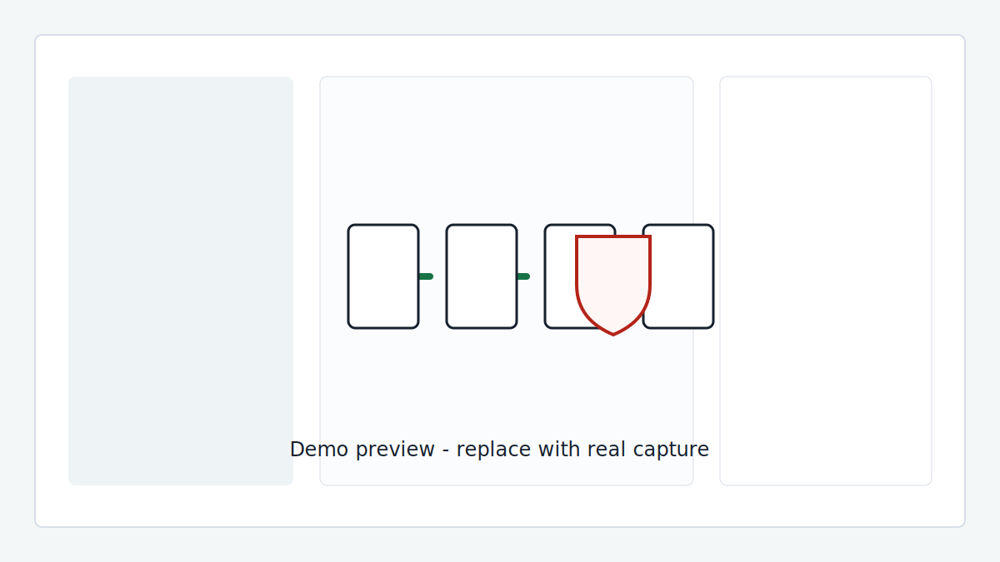
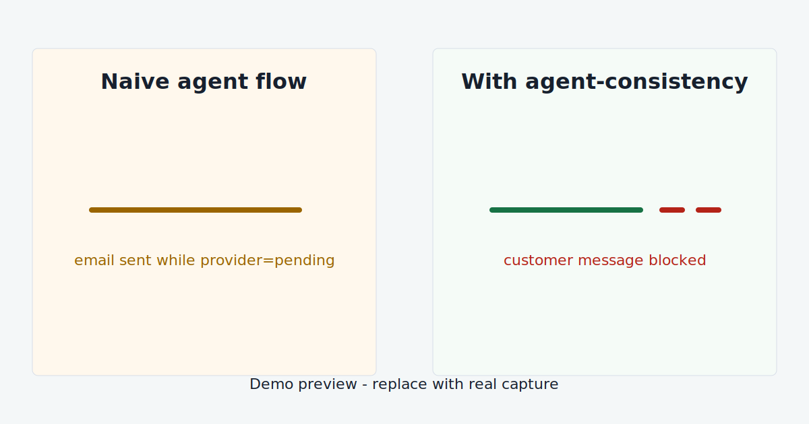
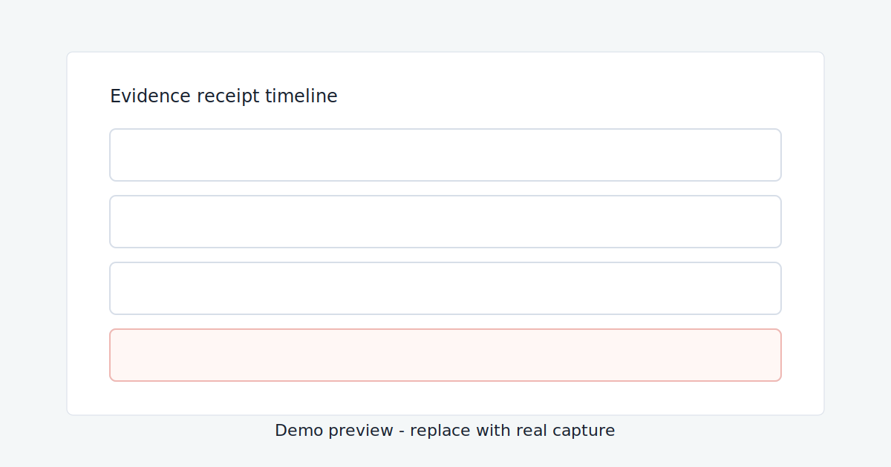
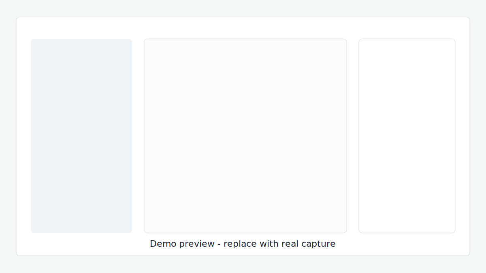
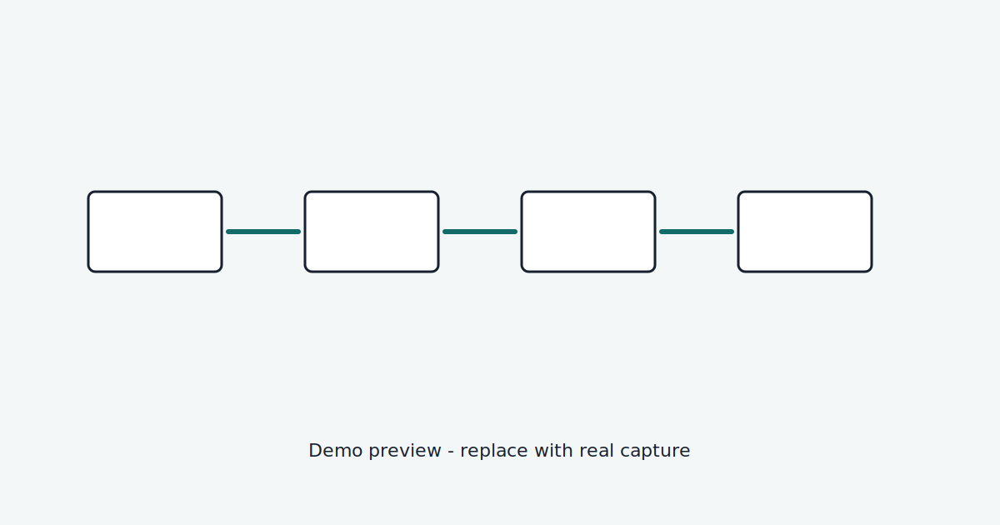

# Agent Reliability Control Center

[Live demo: watch Pending refund get blocked](https://karimbaidar.github.io/agent-consistency-refund-demo/)

Stop agents from saying "done" before the world says "done."



> Your refund agent called the payment API. The API returned 200 OK. The provider status was still `pending`. The agent was about to email "your refund is complete." `agent-consistency` blocks the message and records why.

This repo is the visual demo for
[`agent-consistency`](https://github.com/karimbaidar/agent-consistency). It
shows a five-step refund workflow where state reads, handoff contracts,
evidence, and outcome checks decide whether the customer-facing message is
allowed to continue.

## What You See In 10 Seconds

- The default **Pending refund** scenario starts with the provider at `pending`.
- The naive flow lets the customer message go out anyway.
- The protected flow verifies `refund_settled`, severs the Refund to Comms
  handoff, closes the gate, and suppresses the completed-refund message.
- The right rail shows the receipt timeline and the raw receipt JSON slot.



## Scenarios

| Scenario | What breaks | What gets blocked |
| --- | --- | --- |
| Happy path | Nothing. Every gate passes. | Nothing. The customer response is allowed. |
| Stale policy | Policy v12 is read while v14 is current. | Refund execution. |
| Missing handoff | Previous refund count is omitted. | The policy decision. |
| Pending refund | Provider returns `pending`. | The completed-refund customer message. |

**Pending refund is the flagship.** It is the cleanest false-success bug: the
tool call succeeded, but the business outcome did not happen yet.

## Break It Yourself

The browser controls can force the same failures without editing files:

- flip provider status to `pending`
- drop the required previous refund count handoff fact
- force a stale policy version

The deterministic `heuristic` provider stays the default, so the demo loads
instantly and needs no API keys. Ollama and OpenAI-compatible providers remain
available for local experimentation.



## Run Locally

```bash
python -m pip install -r requirements-dev.txt
make demo
```

Open:

```text
http://127.0.0.1:8000
```

Equivalent direct command:

```bash
MODEL_PROVIDER=heuristic python -m uvicorn refund_demo.web:app --reload
```

## Docker Quickstart

```bash
docker compose down
docker compose up -d ollama
OLLAMA_MODEL=qwen3:8b docker compose run --rm model-pull
MODEL_PROVIDER=ollama docker compose up --build app
```

Open:

```text
http://localhost:8000
```

## How It Maps To The Package

The backend runs the real `agent-consistency` API:

- `WorkflowRun` creates a receipt-backed run.
- `run.step(...)` wraps each agent step.
- `read_state(...)` records the state version used by an agent.
- `handoff(...)` and `consume_handoff(...)` enforce required facts and evidence.
- `verify_outcome(...)` blocks the flow when `refund_settled` is false.

The browser renders the resulting report from `runs/<run_id>/summary.json` and
the receipt log at `runs/<run_id>/receipts.jsonl`.



## Deploy Your Own

The repository includes a static heuristic build for GitHub Pages. It keeps the
same UI and deterministic failure modes, then falls back to client-side sample
reports when the FastAPI backend is not present.

```bash
make static-demo
```

The included `.github/workflows/pages.yml` deploys `dist/` on pushes to `main`
or via manual workflow dispatch. The public URL is:

```text
https://karimbaidar.github.io/agent-consistency-refund-demo/
```

For a live FastAPI deployment, use the same heuristic command on any Python host
that supports long-running web processes:

```bash
MODEL_PROVIDER=heuristic python -m uvicorn refund_demo.web:app --host 0.0.0.0 --port 8000
```

## Architecture



- FastAPI app and workflow code: `refund_demo/`
- Static UI: `refund_demo/static/`
- Deterministic scenarios: `samples/inputs/`
- Generated artifacts: `runs/<run_id>/`

## Tests

```bash
make lint
make test
```

The README image references are tested so placeholders and future captures do
not drift out of the repo.
