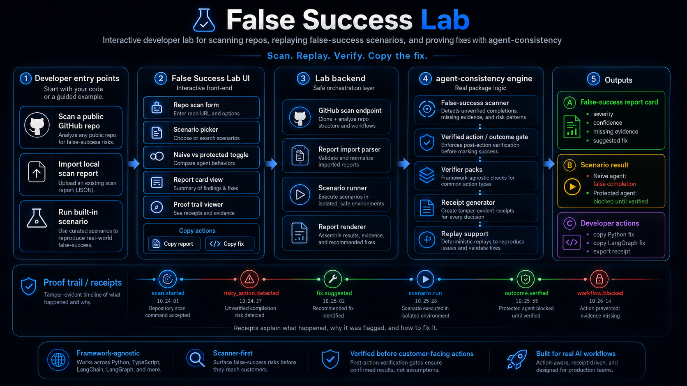

# False Success Lab

[](https://github.com/karimbaidar/false-success-lab/actions/workflows/tests.yml)
[](https://github.com/karimbaidar/false-success-lab/actions/workflows/pages.yml)

[](LICENSE)

[Live demo](https://karimbaidar.github.io/false-success-lab/) |
[Core package: agent-consistency](https://github.com/karimbaidar/agent-consistency)

Scan your AI workflow repo for unverified completion risks.

False Success Lab is the interactive developer lab for `agent-consistency`.
It helps you explore false-success risks in AI workflows and see how
confirmed-result gates prevent unverified completions before they reach users or
customers.



## What this is

False Success Lab is a developer-facing lab for understanding and demonstrating
false-success risk in agent workflows. It combines scanner report cards,
built-in scenarios, proof trails, receipt JSON, and copyable fixes in one small
interactive app.

This repo is the experience layer, not a Python package. The canonical Python
package and reliability engine is
[`agent-consistency`](https://github.com/karimbaidar/agent-consistency).

## Why it exists

Agent workflows often treat a successful tool response as a completed outcome.
That can create unverified completions: refund confirmations before settlement,
support tickets closed without resolution evidence, access grants announced
before the role is actually present, or trades marked complete before fill
confirmation.

False Success Lab makes that failure mode concrete. It shows the naive behavior,
then shows how a verified action, outcome gate, and proof trail block or review
the completion claim.

## What you can do in the lab

- Scan public repos for false-success risk.
- Import local scan reports without giving the browser filesystem access.
- Run built-in false-success scenarios.
- Compare naive vs protected behavior.
- Inspect proof trails and receipt JSON.
- Copy suggested Python, LangGraph, and tool-wrapper fixes.
- Copy a clean Markdown report for issues, PR comments, or social posts.

## Core flows

The first screen offers three entry points:

1. **Scan a public GitHub repo**
2. **Import local scan report**
3. **Try built-in scenarios**

### Public GitHub Repo Scan

Provide a public GitHub URL such as:

```text
https://github.com/org/repo
```

The FastAPI backend calls the scanner exposed by the installed
`agent-consistency` package, downloads the public repo to a temporary directory,
and returns a false-success report card plus Markdown output. If the backend is
running with an older `agent-consistency` package that does not expose the
scanner yet, it returns a clear `503` instead of pretending a scan happened.

### Local Report Import

Browsers cannot directly inspect arbitrary local folders, so local repo scans
stay honest. Run the scanner in your repo:

```bash
agent-consistency scan . --format json > false-success-report.json
```

or:

```bash
agent-consistency scan . --format markdown
```

Then paste or upload that JSON/Markdown report into the lab.

### Built-In Scenario Runner

Built-in scenarios let you understand the same class of failure before scanning
your own code. Each scenario shows a naive completion path, a protected path,
the report card, the proof trail, receipt JSON, missing evidence, and suggested
fixes.

## Built-in scenarios

Refund remains the flagship example, but False Success Lab covers a wider set of
AI workflow risks including support, access, CRM, infrastructure, and trading
scenarios.

| Scenario | Naive behavior | Protected behavior |
| --- | --- | --- |
| Refund customer | Sends a completion email after refund API acceptance. | Blocks until `refund_settled` is confirmed. |
| Close support ticket | Marks work resolved before resolution evidence. | Requires resolution proof before closure. |
| Delete account | Announces deletion without idempotency or confirmation. | Requires idempotency and deletion confirmation. |
| Provision server | Claims infrastructure is ready after request acceptance. | Requires readiness and desired-state checks. |
| Update CRM | Claims a production record changed after a write call. | Requires read-after-write confirmation. |
| Grant access | Tells a user access was granted without checking final role/scope. | Confirms principal, role, and scope. |
| Place trade | Claims an order filled after broker submission. | Requires broker fill confirmation. |

## Architecture

False Success Lab is the interactive demo surface for `agent-consistency`.


It has two main jobs:

1. Scan agent repos for false-success risks.
2. Replay built-in scenarios so developers can see the same failure in a
   controlled environment and copy the fix.

The lab is intentionally split into developer entry points, the interactive UI,
a small backend layer, the real `agent-consistency` package, and outputs like
report cards, proof trails, and copyable fixes.

- **Developer entry points:** built-in scenario runner, public GitHub repo scan,
  and local report import.
- **Interactive UI:** FastAPI-served static HTML, CSS, and JavaScript that keeps
  the demo lightweight and deterministic.
- **Lab backend:** validates public scan requests, calls the scanner, and runs
  the refund scenario through the real workflow path where available.
- **Scanner:** reads source code and returns report-card metrics, findings,
  severity, confidence, missing evidence, and suggested fixes.
- **Verified action / outcome gate:** blocks or reviews unverified completions
  before customer-visible claims continue.
- **Verifier packs:** scenario-specific checks for the expected result, such as
  settlement, deletion confirmation, readiness, role scope, or trade fill.
- **Receipt / proof trail generation:** records state reads, handoffs, tool
  calls, tool responses, outcome verification, and gate decisions.
- **Scenario result:** shows naive vs protected behavior and whether the
  completion was allowed, blocked, or needs review.
- **Copyable fixes:** Python, LangGraph, and tool-wrapper examples for moving
  from report-card findings to verified actions.

## How it works with agent-consistency

`agent-consistency` is the canonical package and reliability engine.
False Success Lab is the interactive report-card and scenario UI.

Use `agent-consistency` when you want to:

- scan a repo
- add verified actions
- generate receipts
- run the benchmark
- integrate outcome gates into workflows

Use False Success Lab when you want to:

- explore report cards visually
- run built-in scenarios
- compare naive vs protected behavior
- inspect proof trails
- copy fixes

The lab does not duplicate package logic unnecessarily. Public GitHub scanning
and protected scenario execution call into `agent-consistency` where the backend
has the required package APIs installed.

## Run locally

```bash
python -m pip install -r requirements-dev.txt
make demo
```

Open:

```text
http://127.0.0.1:8000
```

Equivalent direct command:

```bash
MODEL_PROVIDER=heuristic python -m uvicorn refund_demo.web:app --reload
```

The GitHub Pages build is static. It can show built-in scenarios and pasted
reports. Public GitHub scanning requires the FastAPI backend because it needs to
download and scan a repo server-side.

```bash
make static-demo
```

## Hosted backend

The free backend target is Vercel using the repo-local `pyproject.toml`
`tool.vercel.entrypoint` setting. The current Vercel project is
`false-success-lab-api`, which gives the frontend this default API base URL:

```text
https://false-success-lab-api.vercel.app
```

GitHub Pages automatically tries that backend URL. You can override it for a
test deployment by adding `?api=https://your-service.example.com` to the Pages
URL; the browser stores that API base URL for later visits.

Vercel's free Hobby plan is suitable for this demo backend. Vercel functions
still have duration and resource limits, so very large repository scans may need
the local CLI path. The UI stays honest: if the backend is unavailable, it shows
static demo mode and still supports local report import and built-in scenarios.

The hosted backend currently installs `agent-consistency` from the pinned public
GitHub commit in `requirements.txt`, aligned with the current scanner-enabled
`agent-consistency` 0.3.2 source. After PyPI is confirmed to have the same
scanner APIs, switch the dependency back to a PyPI range such as
`agent-consistency>=0.3.2,<0.4.0`.

To deploy the backend:

1. Import `https://github.com/karimbaidar/false-success-lab` into Vercel or run
   `vercel --prod --name false-success-lab-api`.
2. Keep the default project name `false-success-lab-api` if possible.
3. Check `https://false-success-lab-api.vercel.app/api/health`.
4. Reopen `https://karimbaidar.github.io/false-success-lab/` and scan a public
   GitHub repo.

## Repo rename / project note

This project was previously named `agent-consistency-refund-demo`.

It has evolved into **False Success Lab** because it now covers multiple
false-success scenarios beyond refunds, including support, access, CRM,
infrastructure, and trade workflows.

The GitHub repository has been renamed to
[`karimbaidar/false-success-lab`](https://github.com/karimbaidar/false-success-lab).
Badges and Pages links now use the renamed repo and live demo URL:
`https://karimbaidar.github.io/false-success-lab/`.

See [RENAME_REPO.md](RENAME_REPO.md) for the completed rename note and
post-rename checks.

## Contributing

Scenario contributions should include the scenario name, description, user goal,
workflow steps, failure toggles, source system state, naive result, protected
result, expected receipt fields, copyable fix code, and tests.

See [CONTRIBUTING.md](CONTRIBUTING.md) and
[docs/scenario-contributions.md](docs/scenario-contributions.md).

## Contributors

- [Karim Baidar](https://github.com/karimbaidar), creator and maintainer.

## License

MIT. See [LICENSE](LICENSE).
