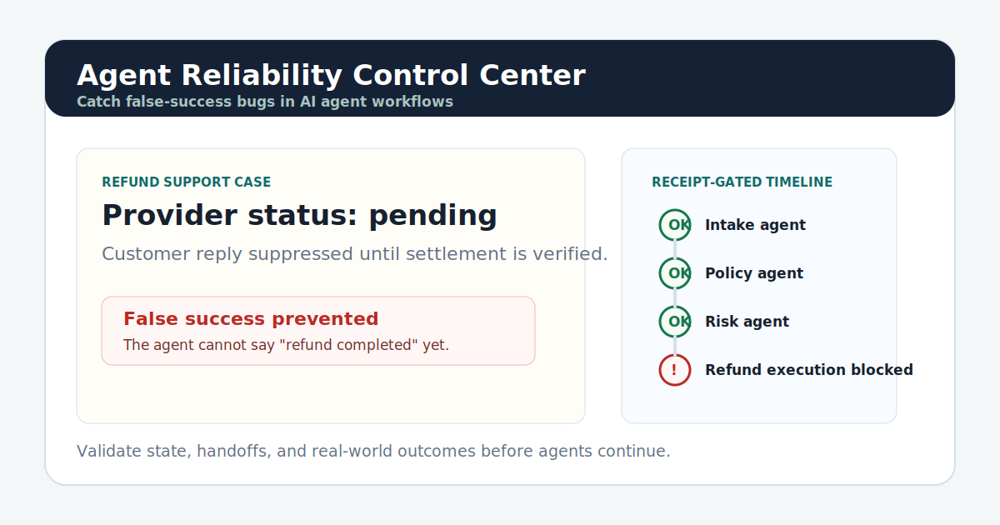
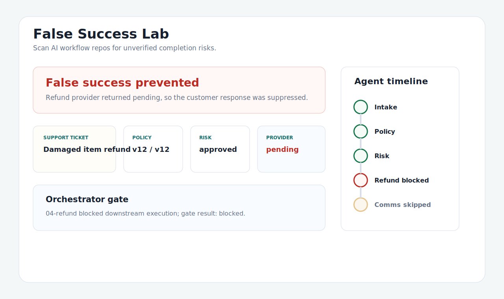

# False Success Lab

[Live demo](https://karimbaidar.github.io/agent-consistency-refund-demo/) |
[agent-consistency](https://github.com/karimbaidar/agent-consistency)

Scan your agent repo, find false-success risks, then watch the gate block them.



False-success bugs happen when an agent says a task is done before the real
world agrees. A tool call returned `200 OK`, a ticket update succeeded, or a
broker accepted an order, but the business outcome still needs proof.

This repo is the public interactive lab for `agent-consistency`. The refund
scenario remains the flagship example, but the product identity is the broader
False Success Lab.

## First Screen

The lab offers three entry points:

1. **Try a built-in false-success scenario**
2. **Scan your own repo**
3. **Scan a public GitHub repo**

## Built-In Scenarios

| Scenario | Naive behavior | Protected behavior |
| --- | --- | --- |
| Refund customer | Sends a completion email after refund API acceptance. | Blocks until `refund_settled` is confirmed. |
| Close support ticket | Marks work resolved before resolution evidence. | Requires resolution proof before closure. |
| Delete account | Announces deletion without idempotency or confirmation. | Requires idempotency and deletion confirmation. |
| Provision server | Claims infrastructure is ready after request acceptance. | Requires readiness and desired-state checks. |
| Update CRM | Claims a production record changed after a write call. | Requires read-after-write confirmation. |
| Grant access | Tells a user access was granted without checking final role/scope. | Confirms principal, role, and scope. |
| Place trade | Claims an order filled after broker submission. | Requires broker fill confirmation. |

Each scenario shows:

- naive vs protected behavior
- false-success report card
- high/medium/low severity
- confidence and top findings
- missing evidence and suggested fixes
- proof trail and receipt JSON
- copyable Python, LangGraph, and tool-wrapper fixes

## Repo Scanning

Public GitHub scans call the backend endpoint:

```text
POST /api/scans/github
```

The endpoint uses the `agent-consistency` scanner, clones the public repo to a
temporary directory, scans it locally, and returns JSON plus Markdown.

Local repo scanning stays honest because a browser cannot inspect arbitrary
local filesystem paths. The lab shows CLI commands and lets users paste or
upload JSON/Markdown reports:

```bash
agent-consistency scan . --format json
agent-consistency scan . --format markdown
agent-consistency scan . --fail-on high
```

Low-confidence findings are review prompts, not certain bugs:

```text
Possible risk, needs review.
```

## Run Locally

```bash
python -m pip install -r requirements-dev.txt
make demo
```

Open:

```text
http://127.0.0.1:8000
```

Equivalent direct command:

```bash
MODEL_PROVIDER=heuristic python -m uvicorn refund_demo.web:app --reload
```

## Docker Quickstart

```bash
docker compose down
docker compose up -d ollama
OLLAMA_MODEL=qwen3:8b docker compose run --rm model-pull
MODEL_PROVIDER=ollama docker compose up --build app
```

Open:

```text
http://localhost:8000
```

## Static Demo

The GitHub Pages build is static. It can show built-in scenarios and pasted
reports. Public GitHub scanning requires the FastAPI backend because it needs to
clone and scan a repo server-side.

```bash
make static-demo
```

## Architecture



- FastAPI app and workflow code: `refund_demo/`
- Static browser UI: `refund_demo/static/`
- Deterministic refund workflow samples: `samples/inputs/`
- Scenario contribution guide: `docs/scenario-contributions.md`
- Generated artifacts: `runs/<run_id>/`

## Tests

```bash
make lint
make test
```
