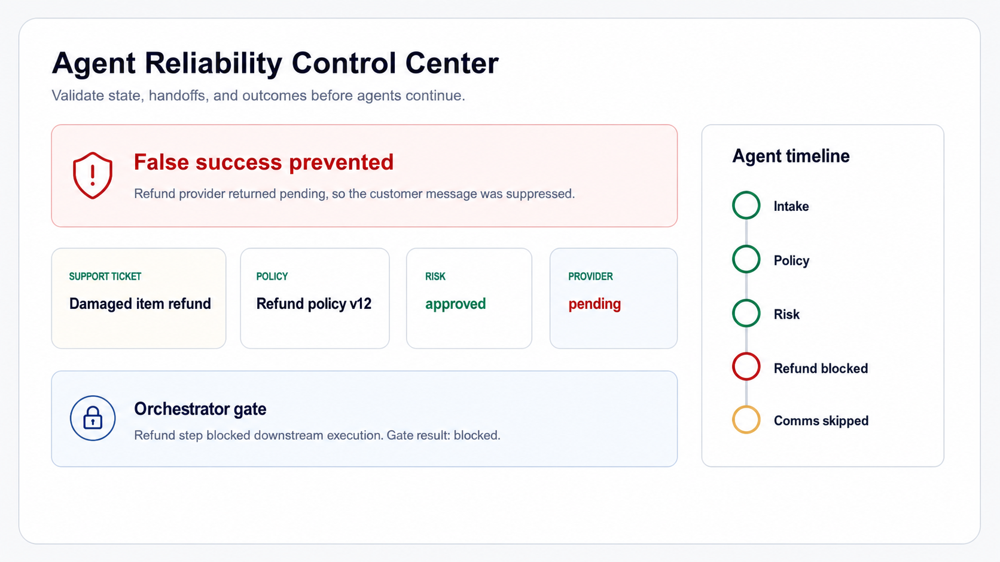
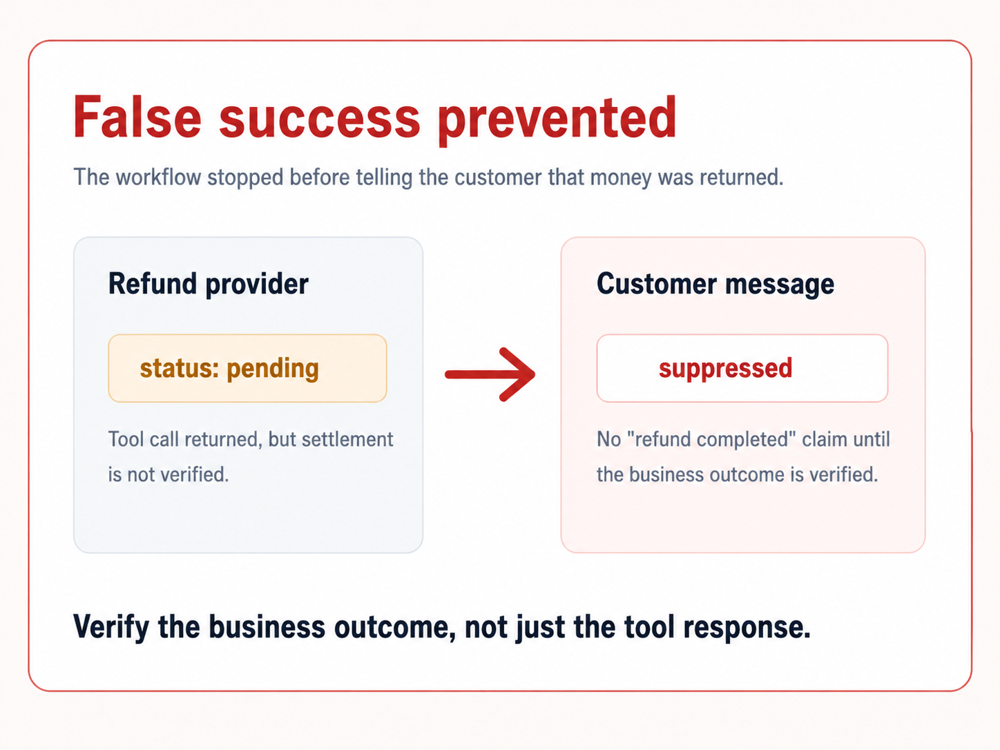
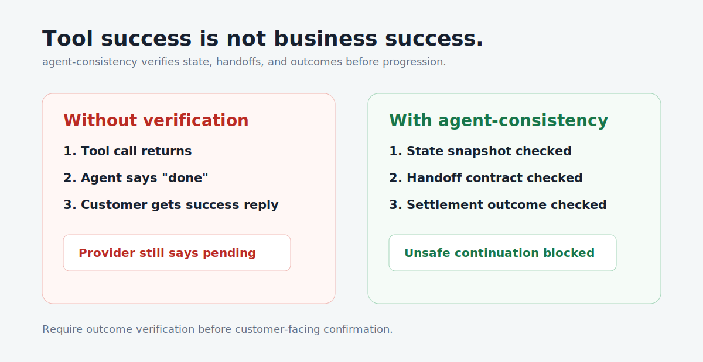
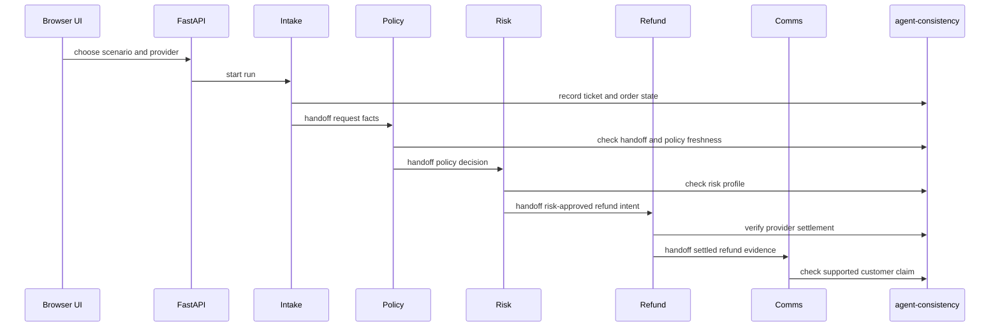

# Agent Reliability Control Center

Catch false-success bugs in a realistic refund workflow.

This demo shows a multi-agent refund workflow that can be blocked when it uses
stale policy, misses handoff facts, or receives a pending refund result from the
payment provider.





Most agent demos stop at tool calls. This demo checks whether the business
outcome actually happened.

## What You Will See

Open the browser app and run a five-agent refund workflow:

- Intake agent
- Policy agent
- Risk agent
- Refund execution agent
- Comms agent

Each step shows a decision summary, facts received, contract checks, evidence,
outcome verification, and issues. The right-side timeline animates as the
orchestrator allows or blocks each handoff.

The most important scenario is **Pending refund**:

> Your agent said "refund completed." The payment provider still said
> "pending." agent-consistency catches that before the customer gets lied to.

## Why This Matters

Agent workflows can look successful while acting on stale state, missing handoff
facts, or unverified tool results. `agent-consistency` adds lightweight
contracts and receipts so workflows prove they read the right state, passed the
right context, and verified the real business outcome.

It is not a full agent framework, not a generic observability dashboard, and not
just output validation. It is a reliability layer for side-effecting agent
workflows.



## Quickstart

```bash
git clone https://github.com/karimbaidar/agent-consistency-refund-demo.git
cd agent-consistency-refund-demo

python -m venv .venv
source .venv/bin/activate
python -m pip install -U pip
python -m pip install -r requirements-dev.txt

MODEL_PROVIDER=heuristic python -m uvicorn refund_demo.web:app --reload
```

Open:

```text
http://localhost:8000
```

The deterministic `heuristic` provider is local, free, and does not call an
external model. Use it for demos, CI, and screenshots.

## Run With Docker

```bash
docker compose down
docker compose up -d ollama
OLLAMA_MODEL=qwen2.5:1.5b docker compose run --rm model-pull
OLLAMA_MODEL=qwen2.5:1.5b MODEL_PROVIDER=ollama docker compose up --build app
```

Open:

```text
http://localhost:8000
```

For larger Ollama models, increase Docker Desktop memory before pulling the
model.

## Demo Scenarios

| Scenario | What breaks | What gets blocked | Why it matters |
| --- | --- | --- | --- |
| Happy path | Nothing. Every gate passes. | Nothing. Customer response is allowed. | Shows proof before progression for a normal refund. |
| Stale policy | Policy v12 is read while v14 is current. | Refund execution. | Approvals should not continue from stale business rules. |
| Missing handoff | Previous refund count is omitted. | Policy eligibility decision. | Agents should not decide from partial context. |
| Pending refund | Provider returns `pending`. | Completed-refund customer message. | Tool success is not business success. |

Run the same scenarios from the CLI:

```bash
python -m refund_demo.cli --input samples/inputs/happy_path.json
python -m refund_demo.cli --input samples/inputs/stale_policy.json
python -m refund_demo.cli --input samples/inputs/missing_handoff.json
python -m refund_demo.cli --input samples/inputs/pending_refund.json
```

The three failure scenarios intentionally return a non-zero exit code because
the workflow correctly blocks continuation.

## How The Workflow Works

The demo uses a sequential receipt-gated handoff:




## What agent-consistency Verifies

- **State verification:** each agent records which state version it read.
- **Handoff verification:** downstream agents receive required facts, evidence,
  and artifacts before they continue.
- **Contract checks:** receipt gates block missing or stale context.
- **Outcome verification:** side effects must prove the business outcome, not
  just return a tool response.
- **Causal links:** each receipt can point to the handoff or artifact it
  consumed.

## Architecture


The app stays intentionally lightweight:

- FastAPI backend in `refund_demo/web.py`
- deterministic workflow in `refund_demo/workflow.py`
- five agent classes in `refund_demo/agents.py`
- UI-friendly report mapping in `refund_demo/view_model.py`
- vanilla HTML, CSS, and JavaScript in `refund_demo/static/`
- run artifacts in `runs/<run_id>/`

Generated run files:

```text
runs/demo-happy-refund/summary.json
runs/demo-happy-refund/report.html
runs/demo-happy-refund/receipts.jsonl
```

## Recording A Demo GIF

1. Start the app with the deterministic provider.
2. Open `http://localhost:8000`.
3. Select **Pending refund**.
4. Start screen recording.
5. Click **Run workflow**.
6. Stop after the red **False success prevented** banner appears.

The GIF should show the support case, right-side timeline, refund provider
pending status, and suppressed customer response.

More notes live in [scripts/capture_demo_notes.md](scripts/capture_demo_notes.md).

## Local Development

```bash
python -m venv .venv
source .venv/bin/activate
python -m pip install -U pip
python -m pip install -r requirements-dev.txt
MODEL_PROVIDER=heuristic python -m uvicorn refund_demo.web:app --reload
```

Generate deterministic sample reports:

```bash
python scripts/generate_demo_reports.py
```

Reset generated runs:

```bash
python scripts/reset_runs.py
```

## Tests

```bash
python -m pytest
ruff check refund_demo tests
```

The README image references are tested so social and architecture assets do not
drift out of the repo.
